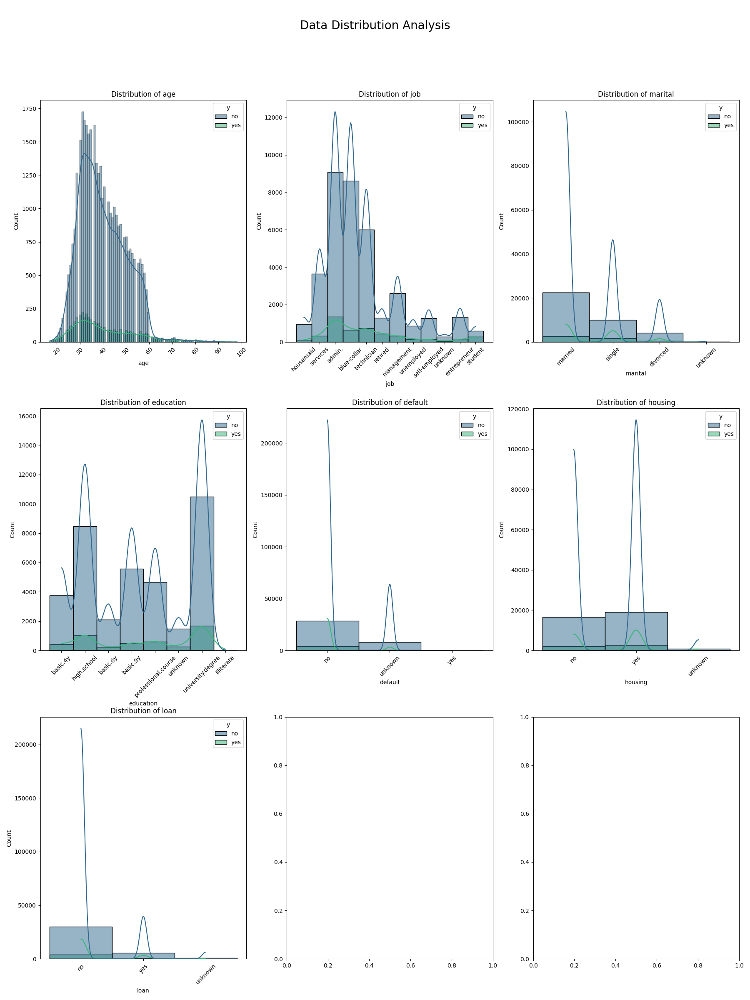
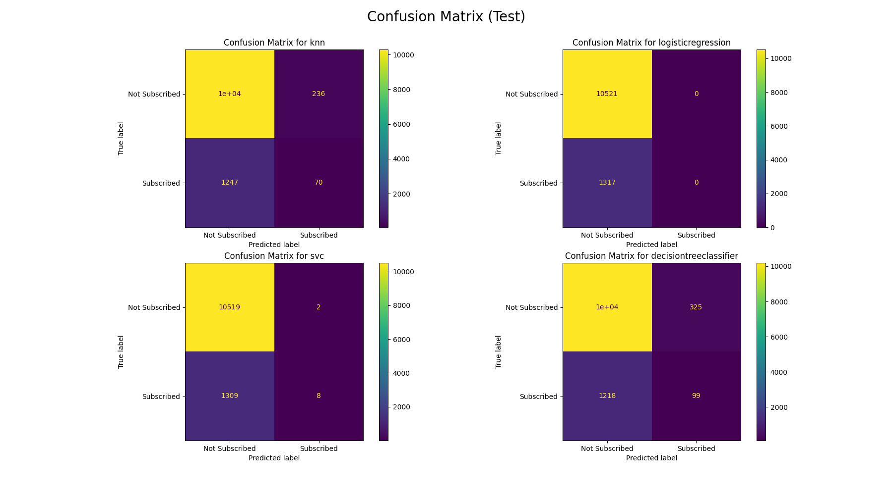
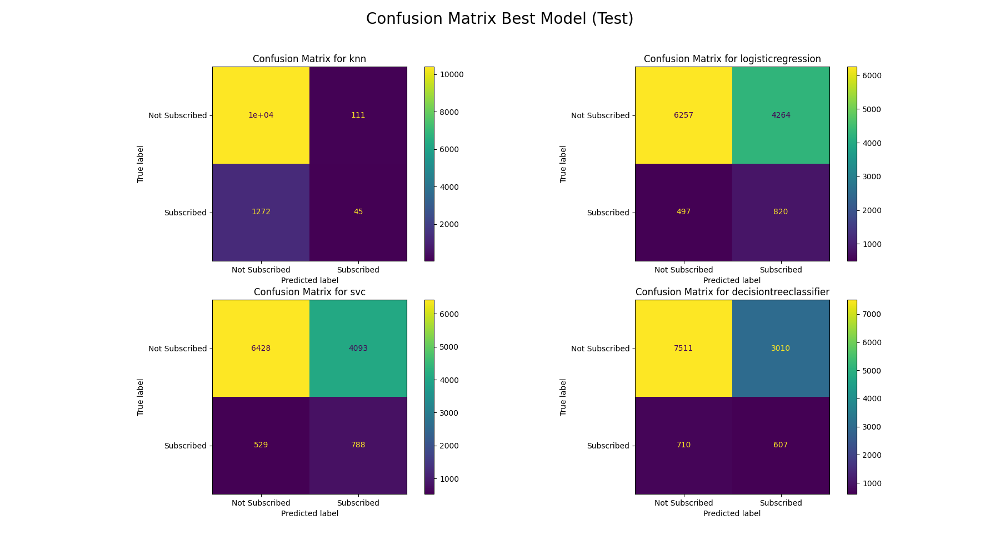
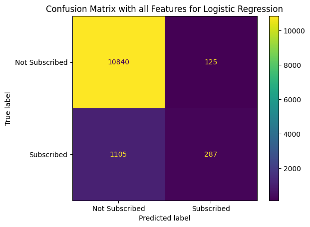
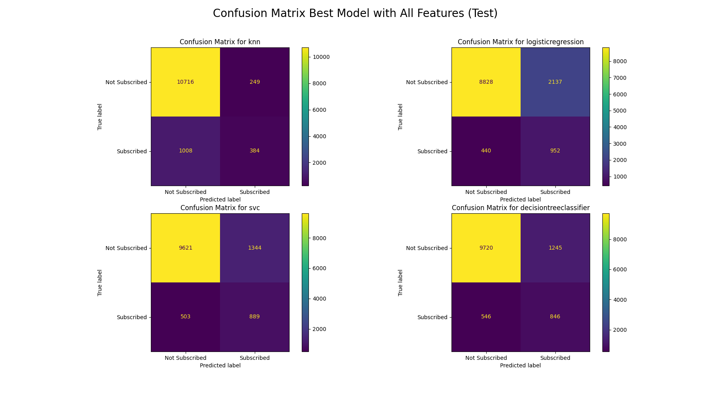

# Required Assignment 17.1: Comparing Classifiers

## Overview
The goal of this project is to compare the performance of the classifiers (k-nearest neighbors, logistic regression, decision trees, and support vector machines)
## Data
The dataset comes from the UC Irvine Machine Learning Repository. The data is from a Portuguese banking institution and is a collection of the results of multiple marketing campaigns.

## Files
- [bank-additional-full.csv](data/bank-additional-full.csv): The dataset used for the analysis.
- [prompt_III.ipynb](prompt_III.ipynb): The Jupyter Notebook containing the analysis and visualizations.

## Instructions
1. Clone this repository.
2. Open `prompt_III.ipynb` in Jupyter Notebook or any compatible IDE.
3. Run the cells to explore the dataset and visualize the results.

## Analysis
For this analysis we will build k-nearest neighbors, logistic regression, decision trees, and support vector machines classifiers to predict the customers who can subscribe to a term deposit based on the direct marketing campaign and compare them on their performance.

### Business Understanding
- **Objective**: Given the client bank profile and direct marketing contact information, The business goal is to find a model that can explain success of a contact, i.e. if the client will subscribe to a term deposit (yes or no).

### Understanding Data

### Proportion of Total Observations that Subscribed
- **Proportion of clients who subscribed to a term deposit:** 11.12%

### Data Understanding
- The dataset collected is related to 17 campaigns that occurred between May 2008 and November 2010, corresponding to a total of 79354 contacts
- Original dataset contains 41187 rows and 21 columns.

### Data Preparation
- **Data Cleaning**: In this step we will determine how to handle missing values, incorrect data types, and outliers.
    - Duration attribute highly affects the output target (e.g., if duration=0 then y='no'). Yet, the duration is not known before a call is performed so for building a practical model we should drop this column.

    #### Distribution of data
    

- **Feature Selection**: Select relevant features for the analysis.
- **Encoding Categorical Variables**: Convert categorical variables into numerical format using techniques like one-hot encoding.
- **Feature Scaling**: Normalize or standardize numerical features.

### Modeling
- **Split the Data**: Divide the dataset into training and testing sets using test_size=0.3
- **Train the Model**: 
- **Evaluate the Model**: In this dataset, “Not Subscribed” (y = no) is far more common than “Subscribed” (y = yes), often around 88–90% no vs 11% yes in the original data. If a model just predicts “no” for everyone, it already gets ~90% accuracy. So accuracy cannot be used as a measure. Also, lost opportunities (customers who would subscribe but weren’t targeted or followed up) are critical for the business, the models should predict maximum cases of true positive classes. A model with high recall score can do this.  

Below are the scores for a Simple model with just bank features 

| Metric                             | Value            |
|------------------------------------|------------------|
| Training Score                     | 0.8887722220211  |
| Test Score                         | 0.8887480993411  |

Classification Report (Test):

|                  | precision | recall | f1-score | support |
|------------------|-----------|--------|----------|---------|
| **Not Subscribed** | 0.89      | 1.00   | 0.94     | 10521   |
| **Subscribed**     | 0.00      | 0.00   | 0.00     | 1317    |
| **accuracy**       |           |        | 0.89     | 11838   |
| **macro avg**      | 0.44      | 0.50   | 0.47     | 11838   |
| **weighted avg**   | 0.79      | 0.89   | 0.84     | 11838   |

Confusion Matrix (Test):

| 10521 | 0 |
|-------|---|
| 1317  | 0 |

This shows a severe class imbalance problem — the model predicts only "Not Subscribed" for every case, giving perfect recall for negatives but 0% recall for positives.

- Below is the ConfusionMatrix for different Models using only Bank Features. It's evident from the image that all models are performing badly. They all have high accuracy but very bad at predicting positive classes.

| Model                  | Train Time   | Train Accuracy | Test Accuracy |
|------------------------|------------:|---------------|--------------|
| knn                    | 0.08029     | 0.889677      | 0.874725     |
| logisticregression     | 0.083323    | 0.888772      | 0.888748     |
| svc                    | 30.100244   | 0.889026      | 0.889255     |
| decisiontreeclassifier | 0.416562    | 0.9139        | 0.869657     |

#### Perform Hyperparameter tuning using GridSearchCV
After adjusting hyperparameters the models performed slightly better but the positive class recall is still bad. From the results its clear, the tuning didn't make much difference.

#### Perform feature engineering
Since the Bank Features alone are not enough to predict if a client will subscribe to a term deposit, Lets include all features and build a LogisticRegression Model.
Below is the classification report and Confusion Matrix

| Class            | Precision | Recall | F1-Score | Support |
|------------------|-----------|--------|----------|---------|
| **Not Subscribed** | 0.91      | 0.99   | 0.95     | 10,965  |
| **Subscribed**     | 0.70      | 0.21   | 0.32     | 1,392   |
| **Accuracy**       |           |        | 0.90     | 12,357  |
| **Macro Avg**      | 0.80      | 0.60   | 0.63     | 12,357  |
| **Weighted Avg**   | 0.88      | 0.90   | 0.88     | 12,357  |

This model performs better. It can now identify 21% of positive classes and almost all negative classes.    

##### below are the results for different best models when used with all features
| Model                     | Not Subscribed Precision | Not Subscribed Recall | Subscribed Precision | Subscribed Recall |
|---------------------------|--------------------------|-----------------------|----------------------|-------------------|
| **KNN**                   | 0.91                     | 0.98                  | 0.61                 | 0.28              |
| **Logistic Regression**   | 0.95                     | 0.81                  | 0.31                 | 0.68              |
| **SVC**                   | 0.95                     | 0.88                  | 0.40                 | 0.64              |
| **Decision Tree**         | 0.95                     | 0.89                  | 0.40                 | 0.61              |

### Evaluation
- **Interpret the Results**: 
  - If catching as many subscribed customers as possible is the top priority (high recall for the positive class), Logistic Regression is the best candidate in its current state — it flags more potential subscribers than any other model.
  - If a balance between recall and precision for Subscribed class is important, SVC has a slight edges, since it keeps false positives lower while still retrieving most subscribers.

### Deployment
#### Next Steps:
- Tune decision threshold to a different value other than the standard 0.5 to get better recall/precision trade-off.
- Use over sampling techniques to balance imbalanced target classes. 
